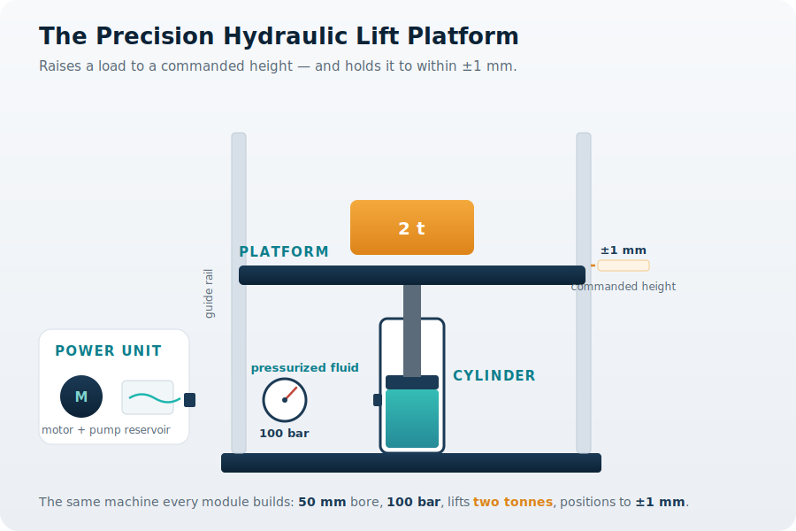

# The Course Machine

> Every lesson in this course is building **one machine**. Meet it here.

## The Precision Hydraulic Lift Platform

The machine has a single, demanding job: **raise a heavy load to a commanded height and hold it there to within ±1 mm.** That one sentence drives every decision in the course — the bore that makes the force, the stroke that sets the height, the pump that sets the speed, the valves that control it, and eventually the sensing and autonomy that make it precise.

The canonical numbers the whole course returns to:

| Quantity | Value |
|----------|-------|
| Bore | 50 mm |
| Working pressure | 100 bar |
| Lift force | ≈ 19,620 N (about 2 tonnes) |
| Holding precision | ±1 mm |
| Steady lift speed | ≈ 85 mm/s |

## The journey

Each module picks up the same platform and adds one layer of capability. The thread is deliberately continuous — every lesson connects the machine you understood last time to the decision you make next.

1. **Introduction** — why fluid power, and how force, energy, and motion move through the machine.
2. **Components** — the cylinder, power unit, and lines that make up the platform.
3. **Fluid fundamentals** — the fluid itself, and why its properties matter.
4. **Actuators** — turning pressure into controlled linear and rotary motion.
5. **Power units** — generating and conditioning the flow.
6. **Valves and control** — directing, regulating, and limiting the flow.
7. **Circuits** — assembling components into working hydraulic circuits.
8. **Electrohydraulics** — adding electrical control and sensing.
9. **Modelling and simulation** — predicting the machine's behaviour.
10. **Control systems** — closing the loop for precise positioning.
11. **The live digital model** — a validated model running beside the real platform, monitoring its health.

Open **[Module 01](module01/index.md)** to begin.
