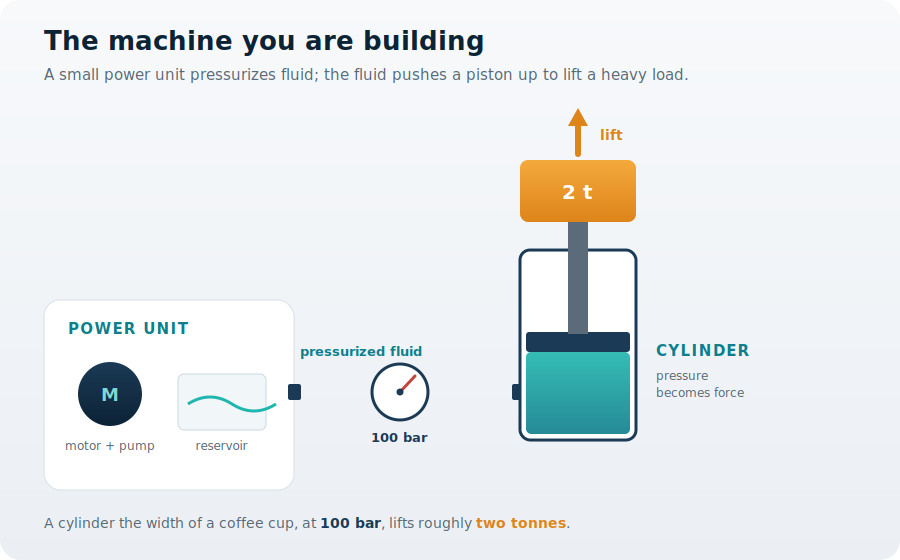
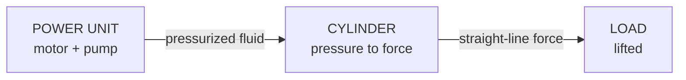

You are here

**Module 01 — Introduction to Fluid Power Systems** · **Unit 1 — What Fluid Power Is** · **Lesson 01 — Why Fluid Power Exists**

# Lesson 01 — Why fluid power exists

> **Module 01 · Lesson 01** · *Meet the machine, and the decision behind it.*
> You are about to build a machine that lifts a heavy load in a tight space. This lesson is where you decide *why* it should be hydraulic at all — before you touch a single formula.

---

## 1. Why This Matters

You are building a machine that has to **lift a two-tonne load**, and the space you have for the lifting mechanism is about the size of a shoebox.

Your first instinct might be an electric motor and a gearbox. Try it on paper and two problems appear immediately. First, a motor-and-gear train strong enough to raise two tonnes is large and heavy — it will not fit your shoebox. Second, even if it fit, the moment you switch the motor off, the load wants to fall; holding it still costs continuous effort and heat.

So you face a real **decision**: *how do you get an enormous, steady force out of a small package?* This is not an abstract question — it is the first engineering choice in your machine, and everything downstream depends on it. This lesson exists because you need an answer before you can go any further. The answer is **fluid power**, and by the end you will know exactly why it wins here.

## 2. Physical Intuition

Here is the idea in one sentence: **a fluid under pressure pushes equally in every direction, so you can send a push down a hose and turn it into a much bigger push at the far end.**

Two everyday things make this believable. Squeeze a closed water bottle and the pressure you create is felt everywhere inside it at once — not just under your thumb. And a small bicycle pump can, with enough strokes, inflate a stiff tire to a pressure that would lift a car. Fluid power combines those two facts: pressure travels freely through the fluid, and pressure acting over a large area becomes a large force.

That is why a hose-connected cylinder can sit exactly where you need the force, while the bulky motor and pump sit out of the way. The fluid carries the effort around corners and concentrates it where it matters.

## 3. The Idea You Now Need

Only now — once you feel *why* you need it — is the relationship worth writing down. Force, pressure, and area are tied together by one simple statement:

\[ F = p \times A \]

A pressure \(p\) pushing on a piston of area \(A\) produces a force \(F\). Read it as a decision tool, not a fact to memorize: if you need more force, you can raise the pressure **or** widen the piston. A fluid lets you do both in a compact cylinder, which is precisely what a motor-and-gearbox cannot do in your shoebox.

This is the seed of every later calculation in the course. For now, you only need to believe it does what your intuition already suggested.

## 4. Visual Explanation



This is the machine, start to finish. A small **power unit** (a motor turning a pump, drawing from a reservoir) raises the fluid's pressure. A **line** carries that pressure to the **cylinder**. The cylinder's piston turns pressure into a straight-line force that **lifts the load**. Keep this picture — it is the System Concept Diagram you are building toward, and every later module adds detail to it.



Energy enters as rotation at the pump, travels as pressure and flow through the fluid, and leaves as force at the load. Compact in, enormous out.

## 5. Engineering Example

Think about a hydraulic excavator. The engine and pump live in the cab; the real work happens metres away at the end of the arm, where compact cylinders curl a bucket through hard soil with tonnes of force. No chain of gears runs out along that arm — just hoses. The same logic powers a car lift in a workshop, a press that stamps car body panels, and the brakes that stop the car you drove in. In each, a modest power source is routed through fluid to wherever a large, steady force is needed. Your two-tonne lift is the same machine, stripped to its essentials.

## 6. Worked Example

<div class="worked" markdown="1">

**Given**

- Bore diameter \( d = 50\ \text{mm} = 0.050\ \text{m} \)
- Working pressure \( p = 100\ \text{bar} = 10{,}000{,}000\ \text{Pa} \)

**Find** — the lifting force the cylinder can produce.

**Assumptions**

- The full working pressure acts on the whole piston face.
- The cylinder is holding or lifting steadily (not accelerating); friction and seal drag are neglected.
- Standard gravity \( g = 9.81\ \text{m/s}^{2} \) is used to express the force as an equivalent mass.

**Solution**

First the piston area:

\[ A = \frac{\pi}{4}\,d^{2} = \frac{\pi}{4}(0.050)^{2} = 1.9635\times10^{-3}\ \text{m}^{2} \]

Then the force that pressure makes on that area:

\[ F = p\,A = (10{,}000{,}000)(1.9635\times10^{-3}) = 19{,}635\ \text{N} \]

**Result**

\[ F \approx 19.6\ \text{kN} \approx 2{,}000\ \text{kg of lift — two tonnes.} \]

**Engineering interpretation** — A piston the width of a coffee cup, fed by pressurized fluid, holds two tonnes. That single number is the whole argument for fluid power: a compact part, a modest pressure, and an enormous, steady force exactly where the machine needs it.

</div>

## 7. Interactive Demonstration

[Open the demo in a new tab ↗](demos/lesson01_force_multiplier.html)

Push on a small piston and watch the force come out of a larger one. Change your push and the two piston sizes, and see how the **same pressure** on a **bigger area** makes a bigger force. Try to answer a question before you drag: if you double the large piston's diameter, does the output force double — or more? (Watch what the area does.) The demo is your intuition, made movable.

## 8. Coding Exercise

*A first taste; you will not need much code in this module.*

```python
import math

def cylinder_force(bore_d_m, pressure_pa):
    """Force a cylinder can push with: F = p * A."""
    A = math.pi / 4 * bore_d_m**2     # piston area, m^2
    return pressure_pa * A            # force, N

F = cylinder_force(0.050, 10_000_000)   # 50 mm bore at 100 bar
print(f"{F:.0f} N  (about {F/9.81:.0f} kg of lift)")   # expect: 19635 N (about 2002 kg)
```

**Your task:** run it, confirm the numbers match the worked example, then find the bore diameter that would let the same 100 bar hold **four tonnes**. (Because force grows with the square of the diameter, you will not need to double it.)

## 9. Knowledge Check

[Open the knowledge check in a new tab ↗](quizzes/lesson01_quiz.html)

*Unlimited attempts, immediate feedback, not graded — check that the idea landed.*

1. Why can fluid power produce a very large force in a very small space?
2. You push 500 N on a small piston and 8000 N comes out a larger one — where did the extra force come from?
3. A hydraulic machine transmits its energy mainly as what?
4. Doubling the output piston's diameter (same push) multiplies the force by roughly how much?
5. True or false: the force multiplier gives you more energy out than you put in.

## 10. Challenge Problem

A colleague proposes replacing your hydraulic lift with an electric motor and a screw jack "to avoid hoses and fluid." Without doing any calculation, give two engineering reasons fluid power may still be the better choice for a compact, heavy, *hold-in-place* lift — and one honest situation where the electric option might actually win. Decisions are rarely one-sided; defend yours, but know its limits.

## 11. Common Mistakes

- **Thinking the fluid creates force.** It does not. The power unit supplies the energy; the fluid only *carries and concentrates* it. Switch off the unit and the force is gone.
- **Confusing more force with more energy.** A bigger piston gives more force but moves a shorter distance. You never get energy for free.
- **Assuming bigger pressure is always the answer.** You can also widen the piston. Good design chooses between them — that is the decision this whole course teaches.
- **Forgetting the hold.** Much of fluid power's value is holding a load steady without continuous mechanical strain. Don't judge it on motion alone.

## 12. Key Takeaways

**The decision you can now make:** whether fluid power is the right choice for a machine that must produce a large, steady force in a compact space — and you can defend that choice against a motor-and-gearbox alternative.

- You are building a machine that must make a **large, steady force in a small space** — the reason fluid power exists.
- Pressurized fluid carries effort through a hose and concentrates it at a piston: **compact in, enormous out.**
- One relationship captures it: \(F = p \times A\). More force means more pressure or more area.
- A 50 mm cylinder at 100 bar holds about **two tonnes** — the argument for fluid power in a single number.
- Keep your machine sketch: a power unit, a line, a cylinder, a load. Lesson 02 follows the energy along that line.

## AI Learning Companion

Copy any prompt below into an AI assistant.

**Tutor prompt** — explain it another way

```
Re-explain why fluid power exists using a different machine than a lift (for example a hydraulic press or an excavator). Focus on why pressurized fluid can make a large, steady force in a compact space, and avoid heavy math.
```

**Practice prompt** — more decisions

```
Give me 5 short scenarios describing a machine that needs force. For each, ask whether fluid power or an electric/mechanical drive is the better first choice, and explain the reasoning. Include answers.
```

**Explore prompt** — connect to the real world

```
Show me 4 real machines that use fluid power. For each, tell me where the power unit is, where the force is needed, and why routing the energy as fluid was the right design choice.
```

## Global Learning Support

Need this lesson in another language? Copy the prompt into an AI assistant. English remains the authoritative source.

**Supported languages (initial):** English · Español · 中文 (Simplified) · Türkçe

```
I just completed Module 01 Lesson 01 — Why fluid power exists.
Explain this lesson in [Spanish / Simplified Chinese / Turkish]. Keep common engineering terms in English where usual.
Then give me: a short summary, three practice questions, and one challenge problem.
```

---

*Next lesson: 02 — How energy is transmitted (following the power along the line from the unit to the load).*
