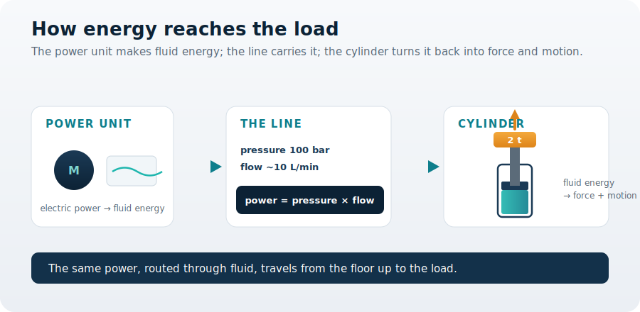
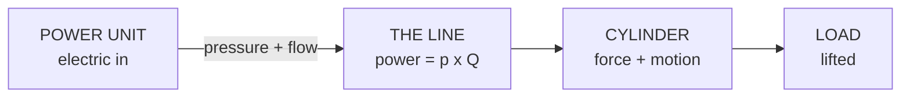

You are here

**Module 01 — Introduction to Fluid Power Systems** · **Unit 1 — What Fluid Power Is** · **Lesson 02 — How Energy Is Transmitted**

# Lesson 02 — How energy is transmitted

> **Module 01 · Lesson 02** · *Following the power from the floor to the load.*
> In Lesson 01 you decided the lift platform should be hydraulic. Now the power unit sits on the floor and the work happens up at the cylinder — so how does the energy actually get from one to the other?
>
> **Learning outcome:** Explain how energy travels from the power unit to the load as pressure and flow, and read a machine's delivered power as pressure × flow.

---

## 1. Why This Matters

Look at your lift platform. The power unit — a motor and pump — sits on the floor beside the frame. The lifting happens a metre away and well above it, where the cylinder pushes the platform up. Between them runs a single hose.

There is no driveshaft climbing the frame. No gears, no belts, no chain carrying power up to the load. Yet the load rises. So you face a plain question: **how does the energy get from the power unit on the floor to the load up on the platform?** And a decision follows from it — *what does that hose actually have to carry, and how much?* Answer this and you understand the one feature that makes fluid power so useful: you can make power in one place and spend it in another. This lesson follows the energy along the line.

## 2. Physical Intuition

The fluid in the hose carries the energy. Picture the hose packed solid with oil. When the pump pushes oil in at one end, oil must come out the other end at the same instant — the column moves as one. So a push at the pump becomes a push at the cylinder, delivered through the fluid.

Two things ride along together. **Pressure** is *how hard* the fluid pushes — set by the load the cylinder must raise. **Flow** is *how fast* fluid is delivered — it sets how quickly the platform climbs. Send more flow and the platform rises faster; build more pressure and it pushes harder. The hose carries both at once, from the floor to the load.

## 3. The Idea You Now Need

Now that you can feel *why* it matters, the relationship is worth naming. The rate at which energy reaches the load — its **power** — is pressure times flow:

$$ P = p \times Q $$

Pressure (how hard) multiplied by flow (how fast) gives power (energy per second). Read it as a decision tool: a fast, gentle motion and a slow, forceful one can demand the *same* power. The line must carry whatever combination the job needs. (We will measure flow precisely, and account for the energy lost to friction along the way, in the Fluid Fundamentals module — here we only need the idea.)

## 4. Visual Explanation



Read it left to right. The **power unit** turns electrical power into fluid energy. The **line** carries that energy as pressure and flow — and their product is the power in transit. The **cylinder** turns it back into force and motion, lifting the load. Energy changes form twice but is never broken into mechanical linkages along the way.



## 5. Engineering Example

A hydraulic excavator makes this vivid. Its engine and pump sit in the cab, but the digging happens metres away at the end of the arm. No gear train runs out along the arm — only hoses, carrying energy as pressurized flow to compact cylinders that curl the bucket through soil. Your lift platform is the same idea in miniature: the power unit stays conveniently on the floor, and the energy is piped to exactly where the lifting is needed. Routing power as fluid is what buys that freedom of placement.

## 6. Worked Example

<div class="worked" markdown="1">

**Given**

- Line pressure $p = 100\ \text{bar} = 10{,}000{,}000\ \text{Pa}$
- Flow the pump delivers $Q = 9.96\ \text{L/min} = 1.66\times10^{-4}\ \text{m}^{3}/\text{s}$

**Find** — the power being delivered to the load through the line.

**Assumptions**

- The line is ideal: no energy lost to friction along the hose (a real line loses a little; covered in Fluid Fundamentals).
- Flow is steady, and all of it reaches the cylinder.

**Solution**

$$ P = p \times Q = (10{,}000{,}000)(1.66\times10^{-4}) $$

**Result**

$$ P \approx 1{,}660\ \text{W} \approx 1.66\ \text{kW} $$

**Engineering Interpretation** — About 1.66 kW of power is flowing down the hose to the load — the rate at which the fluid delivers energy. That number is what the power unit must be built to supply, and it is the figure you will size a motor and pump against later. Raise the flow and the platform climbs faster, but the power rises with it; the line and the power unit must be ready for whatever the job demands.

</div>

## 7. Interactive Demonstration

<iframe src="demos/lesson02_energy_transmission.html" title="Interactive demonstration" style="width:100%;height:820px;border:1px solid #e2e8f0;border-radius:12px"></iframe>

Drive the platform with the power unit. Raise the **flow** and watch the platform climb faster — flow is *how fast*. Raise the **pressure** and watch the gauge, not the speed — pressure is *how hard*. The power readout is their product. Predict before you drag: if you double the flow, what happens to the power delivered?

## 8. Coding Exercise

```python
def hydraulic_power(pressure_pa, flow_m3s):
    """Power carried to the load by the line: P = p * Q (watts)."""
    return pressure_pa * flow_m3s

# the lift platform's line: 100 bar, 9.96 L/min
P = hydraulic_power(10_000_000, 9.96/60_000)
print(f"{P/1000:.2f} kW")   # expect: 1.66 kW
```

**Your task:** confirm the result, then find the flow (in L/min) at which the delivered power reaches **3 kW**, holding pressure at 100 bar. Notice the power rises in step with the flow.

## 9. Knowledge Check

<iframe src="quizzes/lesson02_quiz.html" title="Knowledge check" style="width:100%;height:900px;border:1px solid #e2e8f0;border-radius:12px"></iframe>

*Unlimited attempts, immediate feedback, not graded.*

1. In the lift platform, energy travels from the power unit to the load mainly as what?
2. You want the platform to rise faster (same load) — do you increase flow or pressure?
3. The power delivered to the load equals pressure (combined how?) flow.
4. Why can the power unit sit on the floor while the lifting happens up at the cylinder?
5. True or false: at the same flow, increasing pressure increases the power delivered.

## 10. Challenge Problem

Your platform's power unit could sit right beside the cylinder, or ten metres away in a quieter corner of the workshop, connected by a longer hose. Arguing only from "energy travels as pressure and flow through the line," give one advantage and one cost of moving the power unit far away. (Hint: think about what a longer hose does to the energy in transit — you will quantify it in the Fluid Fundamentals module.) Which placement would you choose, and why?

## 11. Common Mistakes

- **Confusing flow with pressure.** Flow sets *speed*; pressure sets *force*. "More power" is ambiguous until you say which one you mean.
- **Thinking the hose makes energy.** The hose only carries energy; the power unit supplies it. A longer or wider hose changes the losses, not the source.
- **Reasoning about one factor alone.** Power is the *product* p × Q. A small flow at high pressure and a large flow at low pressure can deliver the same power.
- **Forgetting the losses.** Real lines lose a little energy to friction. We assume ideal here; Fluid Fundamentals puts the loss back in.

## 12. Key Takeaways

**The decision you can now make:** read a machine's delivered power as pressure × flow, and decide what its line must carry — and therefore where the power unit can sit relative to the work.

- Energy travels from the power unit to the load as **pressurized, flowing fluid** — no mechanical linkage along the way.
- **Pressure** is how hard; **flow** is how fast; their product, $P = p \times Q$, is the power delivered.
- For the lift platform's line at 100 bar and ~10 L/min, about **1.66 kW** reaches the load.
- Because fluid carries the energy, the power unit can sit on the floor while the work happens up at the cylinder. Lesson 03 looks closer at how the cylinder multiplies that into force.

## AI Learning Companion

Copy a prompt into an AI assistant.

**Deepen** — see the same idea elsewhere

```
Trace the energy path through a hydraulic excavator from engine to bucket. At each stage, say what form the energy is in (mechanical, fluid pressure-and-flow, mechanical again) and where it could be lost. Avoid heavy math.
```

**Challenge** — test the choice

```
Fluid power transmits energy well, but it is not always the best choice. Give me three machines where transmitting power electrically or mechanically would beat hydraulics, and explain the engineering reason in each case.
```

**Explore** — connect to real systems

```
Pick a real machine I would recognize and map its power transmission: where is the power source, how does energy travel to where the work happens, and why did the designers route it that way?
```

## Global Learning Support

Need this lesson in another language? Copy the prompt into an AI assistant. English remains the authoritative source.

**Supported languages (initial):** English · Español · 中文 (Simplified) · Türkçe

```
I just completed Module 01 Lesson 02 — How energy is transmitted.
Explain this lesson in [Spanish / Simplified Chinese / Turkish], keeping common engineering terms in English where usual.
Then give me: a short summary, three practice questions, and one challenge problem.
```

---

*Next lesson: 03 — Force multiplication (how the cylinder turns pressure into a force far larger than its size).*
