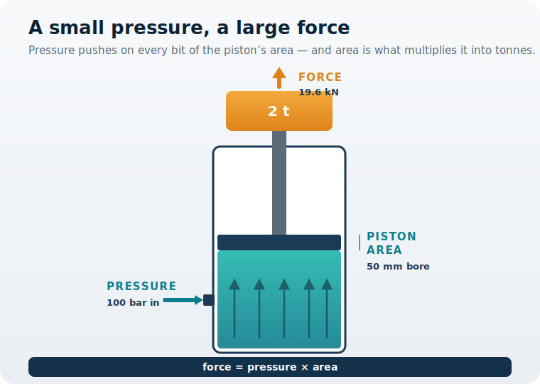
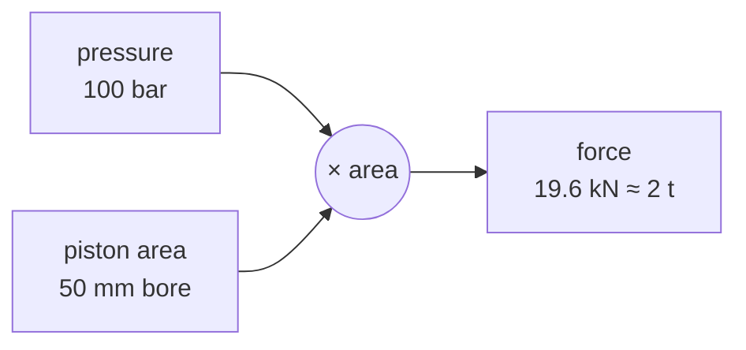

You are here

**Module 01 — Introduction to Fluid Power Systems** · **Unit 1 — What Fluid Power Is** · **Lesson 03 — Force Multiplication**

# Lesson 03 — Force multiplication

> **Module 01 · Lesson 03** · *Turning pressure into tonnes.*
> Lesson 02 followed the energy down the line to the cylinder. Now the energy has arrived — and the cylinder must turn it into enough force to raise the platform's two-tonne load.
>
> **Learning outcome:** Use force = pressure × area to size a cylinder bore for a required load, and explain the force-for-distance trade that comes with it.

---

## 1. Why This Matters

Your lift platform has to raise **two tonnes**, and the pump can hold the line at **100 bar**. Between those two numbers sits a choice you have not made yet: **how big should the cylinder be?**

Too small a bore and the cylinder cannot make enough force — the platform never leaves the ground. Too large and you have paid for a heavy, expensive cylinder you did not need, and it moves slowly. So you face the first real sizing **decision** of the machine: pick the bore that just lifts the load at the pressure you have. To do that, you need to know how a cylinder turns pressure into force — and why a slightly bigger piston makes a much bigger force.

## 2. Physical Intuition

Pressure does not push at a single point — it presses on **every square millimetre** of the piston face at once. So the total upward force is the pressure multiplied by how much area there is to push on. A wider piston offers more area, and the same 100 bar suddenly produces far more force.

That is the multiplication: you do not need more pressure to lift more, you need more **area**. And because area grows with the *square* of the diameter, a small increase in bore brings a large jump in force. A piston the width of a coffee cup, at a pressure a bicycle pump could fear, holds two tonnes.

## 3. The Idea You Now Need

The relationship is the one from Lesson 01, now used as a sizing tool:

$$ F = p \times A $$

Force equals pressure times piston area. Turn it around to **size the bore** for a load you must lift. First the area you need, then the diameter that gives it:

$$ A = \frac{F}{p} \qquad d = \sqrt{\frac{4A}{\pi}} $$

Read it as a decision: fix the load $F$ and the pressure $p$ you can supply, and these tell you the smallest bore that will do the job.

## 4. Visual Explanation



Pressure enters the **cap port** and fills the chamber below the piston. It pushes up on the entire piston face — every arrow in the figure — so the force is the pressure multiplied by the piston's area. The wider that face, the larger the force, at the very same pressure.



## 5. Engineering Example

A hydraulic press shows the multiplication at its limit: a large-bore cylinder turns an ordinary pump pressure into hundreds of tonnes of pressing force, simply because the piston area is enormous. The same physics sets the modest bore of your lift platform — you need exactly enough area to raise two tonnes, no more. Bigger machines are not running higher pressures so much as larger pistons.

## 6. Worked Example

<div class="worked" markdown="1">

**Given**

- Load to lift $F = 2\ \text{tonnes} = 19{,}620\ \text{N}$
- Available pressure $p = 100\ \text{bar} = 10{,}000{,}000\ \text{Pa}$

**Find** — the smallest cylinder bore $d$ that can lift the load.

**Assumptions**

- The full pressure acts on the whole piston face, with the cylinder lifting steadily (not accelerating).
- Friction and seal drag are neglected; we size on the cap-side area.

**Solution**

The piston area the force demands:

$$ A = \frac{F}{p} = \frac{19{,}620}{10{,}000{,}000} = 1.962\times10^{-3}\ \text{m}^{2} $$

The bore diameter that gives that area:

$$ d = \sqrt{\frac{4A}{\pi}} = \sqrt{\frac{4(1.962\times10^{-3})}{\pi}} $$

**Result**

$$ d \approx 0.050\ \text{m} = 50\ \text{mm} $$

**Engineering Interpretation** — A **50 mm bore** is the smallest cylinder that lifts two tonnes at 100 bar — which is exactly the bore the platform uses. Choose anything smaller and it cannot raise the load; choose larger and you carry needless weight and cost, and the platform moves more slowly for the same flow. This single calculation is why the machine is built the way it is.

</div>

## 7. Interactive Demonstration

[Open the demo in a new tab ↗](demos/lesson03_bore_sizing.html)

Size the cylinder yourself. Shrink the bore and watch the force fall until the platform can no longer lift the two-tonne load; widen it and watch the force climb. Find the smallest bore that still lifts at 100 bar — then raise the pressure and see the required bore shrink. The status badge tells you whether your design works.

## 8. Coding Exercise

```python
import math

def bore_for_force(force_n, pressure_pa):
    """Smallest bore that makes a target force: A = F/p, then d = sqrt(4A/pi)."""
    A = force_n / pressure_pa          # required piston area, m^2
    return math.sqrt(4 * A / math.pi)  # bore diameter, m

d = bore_for_force(19_620, 10_000_000)   # lift 2 t at 100 bar
print(f"{d*1000:.1f} mm")                # expect: 50.0 mm
```

**Your task:** confirm the 50 mm result, then find the bore needed to lift the same two tonnes if the pump could only reach **64 bar**. (A lower pressure needs more area — and therefore a wider bore.)

## 9. Knowledge Check

[Open the knowledge check in a new tab ↗](quizzes/lesson03_quiz.html)

*Unlimited attempts, immediate feedback, not graded.*

1. The force a cylinder produces equals what?
2. To get more force at the same pressure, what do you change?
3. Doubling the bore diameter multiplies the force by roughly how much?
4. Lifting 2 tonnes at 100 bar needs a bore of about what size?
5. True or false: a bigger piston gives more force but moves a shorter distance for the same fluid.

## 10. Challenge Problem

You could lift the same two tonnes with a smaller bore by running a higher pressure, or with a lower pressure by choosing a wider bore. Using only force = pressure × area — and remembering from Lesson 02 that a wider piston needs more flow to move at the same speed — describe one cost of the "small bore, high pressure" choice and one cost of the "wide bore, low pressure" choice. Which would you pick for the platform, and why?

## 11. Common Mistakes

- **Reaching for more pressure first.** At a fixed pressure, area is the lever. Often the right move is a wider bore, not a higher pressure.
- **Scaling force with diameter instead of area.** Double the diameter is *four times* the force, because area depends on the square of the diameter.
- **Forgetting the trade.** A bigger bore lifts more but, for the same flow, moves slower and, for the same fluid, a shorter distance. Force is never free.
- **Sizing on the wrong area.** The push comes from the cap-side piston face. (The rod side has less area — a detail you will meet when actuators are studied in depth.)

## 12. Key Takeaways

**The decision you can now make:** size a cylinder bore to lift a required load at a given pressure — and judge the trade between a small high-pressure cylinder and a wide low-pressure one.

- A cylinder multiplies pressure into force through its area: $F = p \times A$.
- To size it, invert the relationship: $A = F/p$, then $d = \sqrt{4A/\pi}$.
- Lifting two tonnes at 100 bar needs about a **50 mm bore** — the platform's actual cylinder.
- More area means more force but, for the same flow, less speed. Lesson 04 steps back to see this same physics at work in real industrial machines.

## AI Learning Companion

Copy a prompt into an AI assistant.

**Deepen** — push the idea further

```
Explain why a hydraulic press can produce hundreds of tonnes of force at a pump pressure of only a few hundred bar. Focus on the role of piston area, and show how the same reasoning sizes a small lift cylinder. Avoid heavy math.
```

**Challenge** — test the trade-off

```
Argue both sides: for a machine that must lift a fixed load, when is a small bore at high pressure the better engineering choice, and when is a wide bore at low pressure better? Consider force, speed, cost, weight, and safety.
```

**Explore** — connect to real systems

```
Pick three real hydraulic machines with very different forces (say a car jack, an excavator, a forging press). Estimate how their cylinder bores and pressures differ, and explain what sets each one.
```

## Global Learning Support

Need this lesson in another language? Copy the prompt into an AI assistant. English remains the authoritative source.

**Supported languages (initial):** English · Español · 中文 (Simplified) · Türkçe

```
I just completed Module 01 Lesson 03 — Force multiplication.
Explain this lesson in [Spanish / Simplified Chinese / Turkish], keeping common engineering terms in English where usual.
Then give me: a short summary, three practice questions, and one challenge problem.
```

---

*Next lesson: 04 — Real industrial machines (where force multiplication and energy transmission appear in the machines you already know).*
