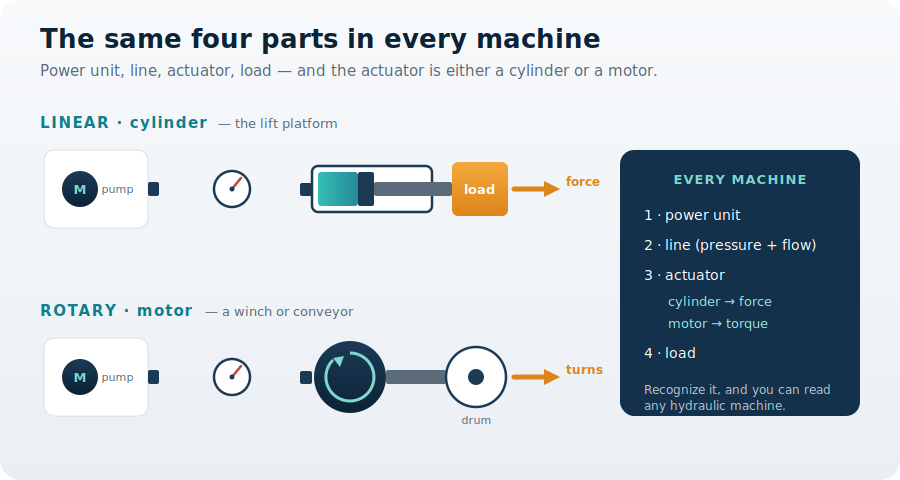
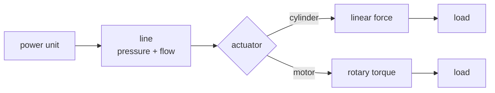

You are here

**Module 01 — Introduction to Fluid Power Systems** · **Unit 1 — What Fluid Power Is** · **Lesson 04 — Real Industrial Machines**

# Lesson 04 — Real industrial machines

> **Module 01 · Lesson 04** · *The same machine, everywhere.*
> You have built the lift platform's ideas one at a time: why fluid power exists, how energy travels, how a cylinder multiplies it into force. This lesson steps back to show those same ideas running inside machines you already know — and gives you a way to read any of them.
>
> **Learning outcome:** Recognize the four-part fluid-power architecture in any machine, and tell whether its actuator is a cylinder (linear) or a motor (rotary).

---

## 1. Why This Matters

Look around a worksite and the hydraulics are everywhere: the excavator curling its bucket, the car lift in the workshop, the press stamping panels, the winch hauling a cable. They look nothing alike. Yet every one of them is **your lift platform in disguise** — the same four parts doing the same job.

So the closing question of this module is a practical skill: **can you look at an unfamiliar machine and read it?** Spot the power unit, follow the line, find the actuator, see the load — and decide what kind of actuator the job needs. That recognition is the **decision** this lesson gives you, and it is what turns a pile of parts into an engineer's mental model.

## 2. Physical Intuition

Every fluid-power machine, large or small, is built from four parts in the same order: a **power unit** makes the pressure, a **line** carries it, an **actuator** turns it back into motion, and a **load** is the work done. Change the size of the parts and you change the machine; change their order and you do not have a hydraulic machine at all.

Only the actuator really varies. If the job is straight-line motion — lifting, pressing, pushing — the actuator is a **cylinder**, giving force. If the job is turning — a winch drum, a conveyor, an auger — the actuator is a **motor**, giving torque. Same fluid energy, two shapes of output.

## 3. The Idea You Now Need

You already have the cylinder's law from Lesson 03:

\[ F = p \times A \]

A motor has the matching law for rotation. Its turning effort — torque — comes from the pressure and how much fluid it swallows per turn (its displacement \(D\)):

\[ T = \frac{p \times D}{2\pi} \]

Read the pair together: a cylinder converts pressure into **force** through its area; a motor converts the same pressure into **torque** through its displacement. Choosing between them is the first thing you decide when you meet a new machine. (Both actuators are studied in depth in Module 04 — here you only need to tell them apart.)

## 4. Visual Explanation



Both rows are the same machine — power unit, line, actuator, load — drawn twice. On top, the actuator is a **cylinder** and the output is a straight-line **force**: that is your lift platform. Below, the actuator is a **motor** and the output is a turning **torque**: that is a winch or a conveyor. The panel on the right is the pattern to memorize.



## 5. Engineering Example

Trace four familiar machines and the pattern appears every time. The **excavator**: engine-and-pump in the cab, hoses out to cylinders that swing the arm and curl the bucket — linear actuators making force. The **car jack**: a small pump and a single cylinder lifting a tonne — the platform in miniature. The **forging press**: a large-bore cylinder turning ordinary pressure into hundreds of tonnes. The **winch**: the same power unit, but a hydraulic motor spinning a drum — a rotary actuator making torque. Four machines, one architecture, two kinds of actuator.

## 6. Worked Example

<div class="worked" markdown="1">

**Given**

- A hydraulic motor with displacement \( D = 50\ \text{cm}^{3}/\text{rev} = 50\times10^{-6}\ \text{m}^{3}/\text{rev} \)
- The same supply pressure as the platform, \( p = 100\ \text{bar} = 10{,}000{,}000\ \text{Pa} \)

**Find** — the torque the motor produces to turn a winch drum.

**Assumptions**

- The motor is ideal: no leakage or friction loss (a real motor delivers a little less).
- Steady running at the rated pressure.

**Solution**

\[ T = \frac{p \times D}{2\pi} = \frac{(10{,}000{,}000)(50\times10^{-6})}{2\pi} \]

**Result**

\[ T \approx 79.6\ \text{N}\,\text{m} \]

**Engineering Interpretation** — The very same 100 bar that drives the platform's cylinder produces about **80 N·m of torque** in this motor — enough to turn a winch drum or a conveyor. Nothing about the power unit changed; only the actuator did. That is the whole lesson: pick the cylinder when the job is a straight push, the motor when the job is a turn.

</div>

## 7. Interactive Demonstration

[Open the demo in a new tab ↗](demos/lesson04_actuator_types.html)

Keep the power unit and pressure fixed, and swap the actuator. In **cylinder** mode you get a straight-line force that lifts the platform; in **motor** mode the same pressure becomes a torque that spins a drum. Watch the readout change from kN to N·m as the output changes from force to torque.

## 8. Coding Exercise

```python
import math

def motor_torque(pressure_pa, disp_m3_per_rev):
    """Torque from a hydraulic motor: T = p * D / (2*pi)."""
    return pressure_pa * disp_m3_per_rev / (2 * math.pi)

T = motor_torque(10_000_000, 50e-6)   # 50 cc/rev motor at 100 bar
print(f"{T:.1f} N·m")                  # expect: 79.6 N·m
```

**Your task:** confirm the 79.6 N·m result, then find the displacement a motor would need to make **160 N·m** at the same 100 bar. (More torque at the same pressure needs more displacement — the rotary version of "more area for more force.")

## 9. Knowledge Check

[Open the knowledge check in a new tab ↗](quizzes/lesson04_quiz.html)

*Unlimited attempts, immediate feedback, not graded.*

1. What are the four parts every fluid-power machine shares?
2. A cylinder is which kind of actuator, and a motor is which kind?
3. To raise the platform straight up, which actuator fits?
4. To spin a winch drum, which actuator fits?
5. True or false: an excavator, a car jack, and a winch share the same basic architecture.

## 10. Challenge Problem

Pick a hydraulic machine you have seen in real life — a garbage truck's packer, a tractor's loader, a barber's chair, a theme-park ride. Sketch its four parts (power unit, line, actuator, load) and decide for each moving part whether it uses a cylinder or a motor, and why. If you are unsure where the power unit is, that is itself a clue about how the machine is built.

## 11. Common Mistakes

- **Looking for the difference in the wrong place.** Machines differ mostly in the *actuator*, not the architecture. The four parts are always there.
- **Assuming hydraulics means cylinders only.** Rotary jobs — drums, conveyors, augers — use motors. Both are everyday fluid-power actuators.
- **Confusing force and torque.** A cylinder makes force (newtons); a motor makes torque (newton-metres). They are not interchangeable units.
- **Missing the power unit.** On big machines it hides in the cab or chassis, far from the work — exactly because the line can carry the energy there.

## 12. Key Takeaways

**The decision you can now make:** read any hydraulic machine as power unit → line → actuator → load, and choose a cylinder for linear jobs or a motor for rotary ones.

- Every fluid-power machine shares four parts: **power unit, line, actuator, load**.
- Only the actuator changes: a **cylinder** gives linear force (\(F = p \times A\)); a **motor** gives rotary torque (\(T = p \times D / 2\pi\)).
- The lift platform is the cylinder case; a winch or conveyor is the motor case — same power unit, same pressure.
- You can now sketch the System Concept Diagram for any machine. **That completes Module 01** — Module 02 opens up the parts themselves, beginning to design the platform component by component.

## AI Learning Companion

Copy a prompt into an AI assistant.

**Deepen** — read a machine end to end

```
Walk me through a hydraulic excavator as a four-part system: where is the power unit, how does the line route energy, which actuators are cylinders and which (if any) are motors, and what load each one moves. Avoid heavy math.
```

**Challenge** — make the actuator choice

```
Give me 5 machine jobs (for example: raise a gate, spin a mixer, clamp a part, drive a wheel, push a ram). For each, ask whether a cylinder or a motor is the better actuator and explain the reasoning. Include answers.
```

**Explore** — find the pattern in the wild

```
Help me identify the power unit, line, actuator, and load in three machines I might see this week. For each, tell me whether the actuator is linear or rotary and how I could tell just by watching it move.
```

## Global Learning Support

Need this lesson in another language? Copy the prompt into an AI assistant. English remains the authoritative source.

**Supported languages (initial):** English · Español · 中文 (Simplified) · Türkçe

```
I just completed Module 01 Lesson 04 — Real industrial machines.
Explain this lesson in [Spanish / Simplified Chinese / Turkish], keeping common engineering terms in English where usual.
Then give me: a short summary, three practice questions, and one challenge problem.
```

---

*Module 01 complete. Next: Module 02 — Fluid Power Components, where you begin designing the lift platform part by part.*
