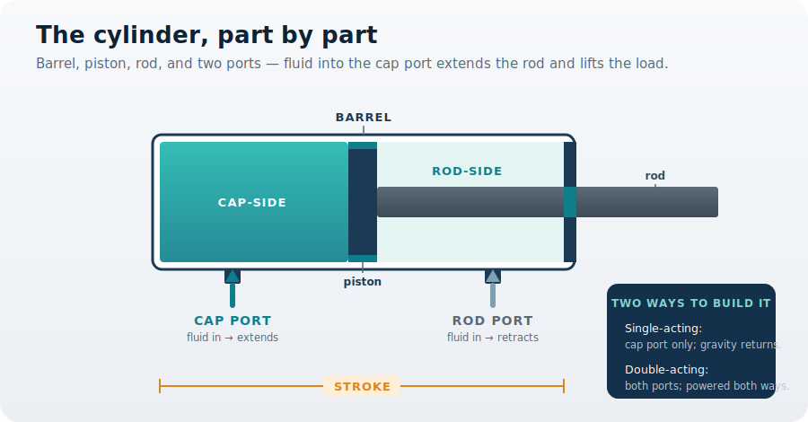

You are here

**Module 02 — Fluid Power Components** · **Unit 1 — The Working Parts** · **Lesson 01 — The Hydraulic Cylinder**

# Lesson 01 — The hydraulic cylinder

> **Module 02 · Lesson 01** · *The part that does the lifting.*
> Module 01 left you able to read any hydraulic machine as power unit → line → actuator → load. Now you start building the lift platform for real, one component at a time — beginning with the actuator that does the visible work: the cylinder.
>
> **Learning outcome:** Choose a cylinder's stroke for a required lift, and decide between single- and double-acting based on how the platform must return and hold.

---

## 1. Why This Matters

The platform's whole job is to **raise a load to a commanded height and hold it to within ±1 mm**. The cylinder is the component that makes that happen — and you have two choices to make before you can specify it. How long a **stroke** does it need, so the rod reaches the commanded height? And should it be **single-** or **double-acting** — does the platform fall back under its own weight, or must the cylinder lower it under control and hold it in place?

Get the stroke wrong and the platform cannot reach its height, or wastes length it never uses. Get the acting type wrong and it cannot hold position, or cannot be lowered safely. Both are real decisions, and both follow from knowing what is inside the cylinder.

## 2. Physical Intuition

A cylinder is a piston sealed inside a barrel. Fluid pushed into the **cap side** presses on the piston and drives the **rod** out — that extension is the lift. The piston splits the cylinder into two chambers, cap side and rod side, and whichever side you pressurize is the way the rod moves.

How far the rod can travel is the **stroke**. To return, the cylinder either lets the load's own weight push it back down — a **single-acting** cylinder, with a line on the cap side only — or it pressurizes the **rod side** to drive the rod back and hold it — a **double-acting** cylinder, with a line on both ends. One is simpler; the other gives you control in both directions.

## 3. The Idea You Now Need

Two component choices follow. The **stroke** must at least equal the lift height you need. And the cap-side **swept volume** — the fluid the pump must push in for a full extension — is the piston area times the stroke:

\[ V = A \times \text{stroke} = \frac{\pi}{4}d^{2} \times \text{stroke} \]

That volume matters twice: it tells the power unit (next lesson) how much fluid to deliver, and combined with flow it sets how long the lift takes. The **acting type** is the second choice — single-acting to save cost when gravity can do the returning, double-acting when the load must be lowered under control or held in place.

## 4. Visual Explanation



Fluid through the **cap port** fills the cap side and pushes the piston to the right, extending the rod by one **stroke**. A single-acting cylinder uses only that port and lets gravity return the load; a double-acting cylinder adds the **rod port**, so fluid on the rod side can drive the piston back and hold it. The piston seals divide the two chambers; the rod gland seals where the rod leaves the barrel.

## 5. Engineering Example

A bottle jack is single-acting: pump fluid in to raise the car, crack a valve and the car's weight pushes the fluid back out. Cheap, simple, and the descent is just controlled leakage. An excavator arm is double-acting: each cylinder must both push and pull — curl the bucket and uncurl it under power — so every cylinder has a line at both ends. The lift platform sits with the excavator: it must lower its two tonnes gently and hold a precise height, which gravity alone cannot do. That points to a double-acting cylinder.

## 6. Worked Example

<div class="worked" markdown="1">

**Given**

- Bore (from Module 01) \( d = 50\ \text{mm} = 0.050\ \text{m} \)
- Required lift height, so stroke \( = 600\ \text{mm} = 0.600\ \text{m} \)

**Find** — the cap-side swept volume, the fluid needed for one full lift.

**Assumptions**

- We size on the cap-side piston area (the full bore); the rod-side volume is smaller and matters only on the return.
- No leakage; the cylinder fills completely.

**Solution**

\[ A = \frac{\pi}{4}d^{2} = \frac{\pi}{4}(0.050)^{2} = 1.9635\times10^{-3}\ \text{m}^{2} \]

\[ V = A \times \text{stroke} = (1.9635\times10^{-3})(0.600) = 1.178\times10^{-3}\ \text{m}^{3} \]

**Result**

\[ V \approx 1.18\ \text{L} \]

**Engineering Interpretation** — A full lift needs about **1.18 litres** of fluid on the cap side. That is the demand the power unit must meet next lesson, and at the flow from Module 01 it fixes the lift time. Because the platform must lower under control and hold ±1 mm, it needs the rod-side line too — a **double-acting** cylinder.

</div>

## 7. Interactive Demonstration

[Open the demo in a new tab ↗](demos/lesson01_cylinder.html)

Set the stroke and watch the swept volume change — a longer stroke lifts higher but needs more fluid. Then switch between single- and double-acting on the return: single-acting drops the load on its own weight with no rod-side line, while double-acting drives it down through the rod port. Watch which port carries the fluid in each case.

## 8. Coding Exercise

```python
import math

def swept_volume(bore_m, stroke_m):
    """Cap-side swept volume of a cylinder: V = (pi/4) d^2 * stroke."""
    A = math.pi / 4 * bore_m**2
    return A * stroke_m            # cubic metres

V = swept_volume(0.050, 0.600)     # 50 mm bore, 600 mm stroke
print(f"{V*1000:.2f} L")           # expect: 1.18 L
```

**Your task:** confirm the 1.18 L result, then find the swept volume if the platform only needed a **400 mm** lift. (Less stroke means less fluid per lift — and a faster lift at the same flow.)

## 9. Knowledge Check

[Open the knowledge check in a new tab ↗](quizzes/lesson01_quiz.html)

*Unlimited attempts, immediate feedback, not graded.*

1. Which part divides the cap side from the rod side?
2. Fluid into the cap port makes the rod do what?
3. What is a cylinder's stroke?
4. How does a single-acting cylinder return?
5. When do you need a double-acting cylinder?

## 10. Challenge Problem

The platform could be built single-acting (cheaper, fewer hoses, gravity lowers it) or double-acting (a line at both ends, powered both ways). Using what you know about the platform's job — lower two tonnes gently and hold a height to ±1 mm — argue which one it must be, and name one situation where the cheaper single-acting choice would actually be fine.

## 11. Common Mistakes

- **Sizing stroke to the load instead of the travel.** Stroke is set by how far the platform must move, not by how heavy the load is. The load set the bore (Module 01); the lift height sets the stroke.
- **Forgetting the swept volume.** A longer stroke needs proportionally more fluid per lift, which the power unit must supply — it is not free.
- **Assuming single-acting can hold a position.** Without a rod-side line, the cylinder cannot resist or control the descent; it relies on the load's weight.
- **Sizing on the rod side by mistake.** The rod takes up area on the rod side, so that chamber holds less fluid and makes less force than the cap side.

## 12. Key Takeaways

**The decision you can now make:** specify a cylinder's stroke for a required lift, and choose single- or double-acting based on how the load must return and be held.

- A cylinder is a piston in a barrel; cap-side fluid extends the rod, rod-side fluid retracts it.
- **Stroke** equals the lift height; cap-side **swept volume** is \( V = A \times \text{stroke} \) — about 1.18 L for the platform.
- **Single-acting** returns on the load's weight (simple, cheap); **double-acting** is powered both ways and can hold position.
- The platform needs a **double-acting** cylinder for controlled lowering and ±1 mm holding. Lesson 02 designs the **power unit** that must deliver this volume and flow.

## AI Learning Companion

Copy a prompt into an AI assistant.

**Deepen** — go inside the part

```
Explain the main internal parts of a hydraulic cylinder — barrel, piston, rod, piston seals, rod gland — and what each one does. Then explain why the rod side of a double-acting cylinder makes less force than the cap side at the same pressure.
```

**Challenge** — make the design call

```
For three machines (a scissor lift, a dump-truck bed, a press), decide whether each needs a single- or double-acting cylinder and justify it by how the load returns and whether it must hold position. Include answers.
```

**Explore** — connect to sizing

```
Walk me through how a cylinder's bore, stroke, and swept volume connect to the force it makes and the fluid it needs, using the lift platform's numbers (50 mm bore, 600 mm stroke, 100 bar) as the example.
```

## Global Learning Support

Need this lesson in another language? Copy the prompt into an AI assistant. English remains the authoritative source.

**Supported languages (initial):** English · Español · 中文 (Simplified) · Türkçe

```
I just completed Module 02 Lesson 01 — The hydraulic cylinder.
Explain this lesson in [Spanish / Simplified Chinese / Turkish], keeping common engineering terms in English where usual.
Then give me: a short summary, three practice questions, and one challenge problem.
```

---

*Next lesson: 02 — The power unit (the pump, motor, and reservoir that deliver the fluid the cylinder needs).*
