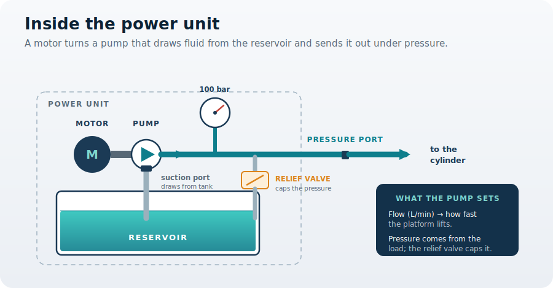

You are here

**Module 02 — Fluid Power Components** · **Unit 1 — The Working Parts** · **Lesson 02 — The Power Unit**

# Lesson 02 — The power unit

> **Module 02 · Lesson 02** · *The part that makes the fluid move.*
> Lesson 01 sized the cylinder: a full lift needs 1.18 L of fluid, and the speed of that lift depends on how fast the fluid arrives. This lesson builds the component that delivers it — the power unit, where a motor turns a pump that draws from a reservoir.
>
> **Learning outcome:** Size a pump's flow to a required lift speed, and find the motor power it demands.

---

## 1. Why This Matters

The cylinder is ready, but nothing moves until fluid arrives. The platform must not only reach its height — it must do so at a workable speed, neither crawling nor slamming. That speed is set entirely by how fast fluid is pushed into the cap side, which is the job of the **power unit**: a pump, the motor that turns it, and a reservoir to draw from.

So the decision is this: how much **flow** must the pump deliver to lift the platform at the speed you want — and how powerful a **motor** does that flow demand? Pick the flow too low and the lift drags; too high and you are paying for a motor far bigger than the job needs. Both follow from one idea most people get backwards: what a pump actually does.

## 2. Physical Intuition

A pump does not make pressure. It makes **flow** — it moves a volume of fluid each second. Pressure appears only when that flow runs into something that resists it. Push fluid into an open hose and the gauge barely moves; push it under a two-tonne load and the pressure climbs to exactly what the load demands, and no more. The pump sets the flow; the **load** sets the pressure.

That splits the power unit's two questions cleanly. **Flow** decides how fast the platform rises, because the fluid arriving each second has to fill the cap side. **Pressure** is handed to you by the load you already sized in Module 01. The motor then has to supply both at once — it spins the pump hard enough to push the chosen flow against the load's pressure. The reservoir simply holds the fluid the pump draws on, and lets it cool and settle.

## 3. The Idea You Now Need

To move the piston at a speed \( v \), fluid must arrive fast enough to fill the area it sweeps. So the flow the pump must deliver is the piston area times the speed:

\[ Q = A \times v \]

And the motor must supply the hydraulic power, which is the pressure the load demands times that flow — the same relationship you met in Module 01:

\[ P = p \times Q \]

These two set the whole power unit. Flow sizes the pump; pressure times flow sizes the motor; and the reservoir is sized to hold roughly two to three times the pump's per-minute flow, so it never runs dry or overheats.

## 4. Visual Explanation



The motor turns the pump, which draws fluid up the **suction line** from the reservoir and pushes it out the **pressure port** toward the cylinder. The gauge reads the pressure the load creates. The **relief valve** is the safety limit: if pressure ever climbs past its setting, it opens and sends fluid back to the tank, so the load can never drive the pressure higher than the system is built for.

## 5. Engineering Example

Two machines, same pump idea. A log splitter pushes slowly with enormous force: it runs a small flow at very high pressure, so its pump is modest but its motor and relief setting are high. A packaging conveyor runs the opposite way: large flow at low pressure, moving quickly under a light load, so its pump is large but the pressure stays low. Neither pump "makes" its pressure — each just delivers flow, and the load sets the rest. The lift platform sits in between: a moderate flow of about 10 L/min to lift at a sensible speed, against the 100 bar its two-tonne load demands.

## 6. Worked Example

<div class="worked" markdown="1">

**Given**

- Piston area (50 mm bore, from Module 01) \( A = 1.9635\times10^{-3}\ \text{m}^{2} \)
- Target lift speed \( v = 85\ \text{mm/s} = 0.085\ \text{m/s} \)
- Pressure the load demands \( p = 100\ \text{bar} = 1\times10^{7}\ \text{Pa} \)

**Find** — the pump flow needed, and the motor power it demands.

**Assumptions**

- The pump delivers all its flow to the cylinder (no leakage, relief valve closed in normal lifting).
- Steady lift at constant speed; we ignore the brief start-up.

**Solution**

\[ Q = A \times v = (1.9635\times10^{-3})(0.085) = 1.669\times10^{-4}\ \text{m}^{3}/\text{s} \]

\[ Q = 1.669\times10^{-4} \times 60000 = 10.0\ \text{L/min} \]

\[ P = p \times Q = (1\times10^{7})(1.669\times10^{-4}) = 1669\ \text{W} \approx 1.67\ \text{kW} \]

**Result**

\[ Q \approx 10\ \text{L/min}, \qquad P \approx 1.67\ \text{kW} \]

**Engineering Interpretation** — A pump delivering about **10 L/min** lifts the platform at 85 mm/s, so a 600 mm lift takes roughly **7 seconds**. The motor must supply about **1.67 kW** to push that flow against the load. The reservoir is then sized at two to three times the per-minute flow — roughly **20–30 L** — so the pump always has fluid to draw and the oil stays cool.

</div>

## 7. Interactive Demonstration

[Open the demo in a new tab ↗](demos/lesson02_power_unit.html)

Set the pump flow and run a lift. At 10 L/min the platform takes about seven seconds; double the flow and it lifts in half the time — but watch the motor power double too. Flow buys speed, and you pay for it in motor size.

## 8. Coding Exercise

```python
import math

def pump_sizing(bore_m, speed_ms, pressure_pa):
    """Flow (L/min) and motor power (kW) to lift at a given speed."""
    A = math.pi / 4 * bore_m**2
    Q = A * speed_ms              # m^3/s
    Q_Lmin = Q * 60000            # convert m^3/s -> L/min
    P = pressure_pa * Q           # watts
    return Q_Lmin, P / 1000       # L/min, kW

Q, P = pump_sizing(0.050, 0.085, 100e5)   # 50 mm bore, 85 mm/s, 100 bar
print(f"{Q:.1f} L/min, {P:.2f} kW")        # expect: 10.0 L/min, 1.67 kW
```

**Your task:** confirm the 10 L/min and 1.67 kW result, then find the flow and motor power needed to lift **twice as fast** (170 mm/s). Notice the flow and the power both double — speed is never free.

## 9. Knowledge Check

[Open the knowledge check in a new tab ↗](quizzes/lesson02_quiz.html)

*Unlimited attempts, immediate feedback, not graded.*

1. What does a pump directly create?
2. What does the pump's flow rate mainly set?
3. Where does the system pressure come from?
4. The motor power equals what?
5. What is the reservoir's job?

## 10. Challenge Problem

You want the platform to lift in half the time. Explain what must change in the power unit: what happens to the required flow, and what happens to the motor power? Then explain why you cannot simply keep raising the flow forever — name two limits that stop you (think about the lines the fluid must pass through, and the motor).

## 11. Common Mistakes

- **Thinking the pump makes the pressure.** The pump makes flow; the load makes the pressure. A pump rated "100 bar" only means it can survive that pressure, not that it produces it.
- **Sizing the motor for flow alone.** Motor power is pressure × flow. A high flow at high pressure can demand a surprisingly large motor.
- **Forgetting the relief valve.** Without it, a stuck or overloaded cylinder lets the load drive pressure past the system's limit. The relief valve caps it.
- **Undersizing the reservoir.** Too small a tank starves the pump and lets the oil overheat; the rule of thumb is two to three times the per-minute flow.

## 12. Key Takeaways

**The decision you can now make:** size a pump's flow to a target lift speed, and find the motor power that flow demands.

- A pump creates **flow**, not pressure; the **load** sets the pressure, and the relief valve caps it.
- Flow sets speed: \( Q = A \times v \) — about 10 L/min lifts the platform at 85 mm/s.
- Motor power is \( P = p \times Q \) — about 1.67 kW for the platform.
- The reservoir holds two to three times the per-minute flow. Lesson 03 sizes the **lines, fittings, and ports** that must carry this flow without choking it.

## AI Learning Companion

Copy a prompt into an AI assistant.

**Deepen** — pump types

```
Explain the difference between a fixed-displacement and a variable-displacement hydraulic pump, and between gear, vane, and piston pumps. For a lift platform that needs about 10 L/min at 100 bar, which type would you expect and why?
```

**Challenge** — trace the power

```
For the lift platform (50 mm bore, 85 mm/s lift, 100 bar), walk through how electrical power at the motor becomes hydraulic power and then mechanical lifting power. Where are the losses, and roughly how efficient is each stage? Include numbers.
```

**Explore** — pressure vs flow

```
Explain, with everyday analogies, why a hydraulic pump produces flow rather than pressure, and why the load determines the pressure. Give me two examples where the same pump sees very different pressures.
```

## Global Learning Support

Need this lesson in another language? Copy the prompt into an AI assistant. English remains the authoritative source.

**Supported languages (initial):** English · Español · 中文 (Simplified) · Türkçe

```
I just completed Module 02 Lesson 02 — The power unit.
Explain this lesson in [Spanish / Simplified Chinese / Turkish], keeping common engineering terms in English where usual.
Then give me: a short summary, three practice questions, and one challenge problem.
```

---

*Next lesson: 03 — Lines, fittings, and ports (the conductors that must carry the pump's flow to the cylinder without choking it).*
