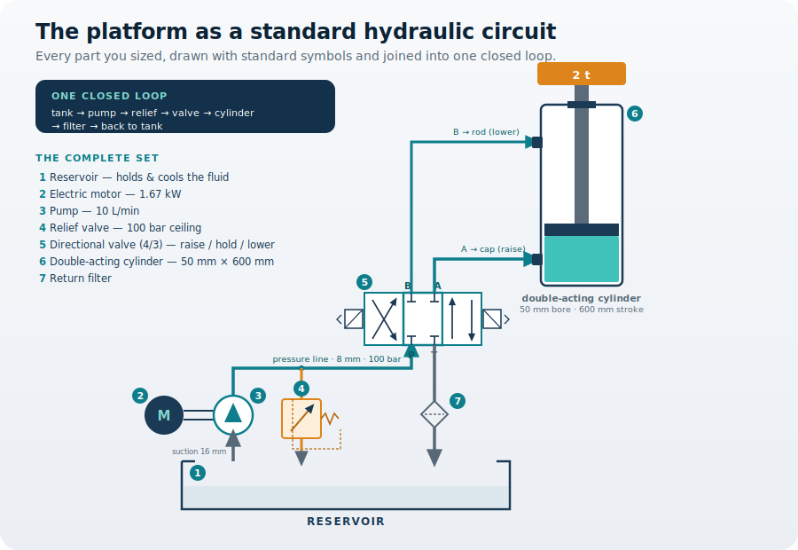

!!! abstract "You are here"
    **Module 02 — Fluid Power Components**  ·  **Unit 1 — The Working Parts**  ·  **Lesson 04 — The complete component set**

# Lesson 04 — The complete component set

> **Module 02 · Lesson 04** · *The parts list, connected into one machine.*
> Lessons 01–03 sized the platform's three core parts: a double-acting cylinder (50 mm bore, 600 mm stroke, 1.18 L per lift), a power unit (a ~10 L/min pump, a ~1.67 kW motor, a reservoir, and a relief valve set at 100 bar), and the lines, fittings, and ports that carry the flow (an 8 mm pressure line, a 16 mm suction line). This lesson assembles them into one working circuit — and finds the one component still missing.
>
> **Learning outcome:** Write the platform's complete component list and describe how the parts connect into a single closed circuit that can raise, hold, and lower the load.

---

## 1. Why This Matters

You have specified three parts, but right now they are still three separate parts on a bench. The pump can make flow and the cylinder can lift — but nothing yet decides *where* the pump's flow goes. Press start and the pump just pushes fluid; it has no way to send it to the cap side to **raise** the load, hold it for a precise **hold**, or send it to the rod side to **lower** it under control. A double-acting cylinder was chosen in Lesson 01 exactly so the platform could do all three — but the component that actually commands them has not appeared yet.

So the decision this lesson settles is the whole module's payoff: **what is the platform's complete component list, and how do the parts connect into one circuit** that can raise, hold, and lower the load — and return its fluid safely to the tank. Getting this right turns a pile of sized parts into a machine.

## 2. Physical Intuition

Think of the fluid as always travelling a **loop**, never a dead end. It leaves the reservoir, is pushed by the pump, does its work at the cylinder, and comes back to the reservoir to rest and cool — then goes round again. A hydraulic system is a closed circuit, and every component sits somewhere on that loop with a job.

Two jobs are still unfilled. First, **routing**: something must steer the pump's flow — to the cap side, to nowhere (hold), or to the rod side — and that is a **directional control valve** sitting between the power unit and the cylinder. Second, **protection and care**: the **relief valve** (already in the power unit) caps the pressure so the load can never burst the system, and a **filter** on the return keeps grit out of the fluid before it re-enters the tank. Add those, and the loop is complete: reservoir → pump → relief → directional valve → cylinder → return → filter → reservoir.

## 3. The Idea You Now Need

A working hydraulic platform is a **closed circuit** built from a small, standard set of parts, each on the loop:

- **Reservoir** — holds and cools the fluid the pump draws on.
- **Electric motor + pump** — the power unit; the motor turns the pump, which makes the flow.
- **Relief valve** — the pressure ceiling; opens to tank if pressure exceeds its setting.
- **Directional control valve** — routes flow to raise, hold, or lower the load.
- **Double-acting cylinder** — the actuator that lifts and lowers.
- **Filter** — cleans the returning fluid.
- **Lines, fittings, and ports** — the conductors sized to carry the flow.

The new member is the **directional control valve**. It is the bridge between everything you have sized so far: the power unit feeds its inlet, and its outlets feed the cylinder's cap and rod ports. The platform cannot be commanded without it. Exactly *which* valve to specify is a Module 06 question; here you only need to know it belongs in the set and where it sits.

## 4. Visual Explanation

<figure markdown>
  { width="760" }
</figure>

Follow the loop. The motor turns the pump, which draws fluid up the suction line from the **reservoir** and pushes it out at 100 bar. The **relief valve** tees off right at the pump: if pressure ever exceeds its setting it dumps flow back to tank. The pressure line then reaches the **directional control valve**, which sends the flow to the cylinder's **cap port** to raise, blocks both ports to hold, or sends it to the **rod port** to lower. Returning fluid runs back through the valve, past a **filter**, and into the reservoir to cool. Every component you sized in this module is on this one loop.

## 5. Engineering Example

A car's hydraulic brake system is the same idea stripped to essentials: a reservoir, a "pump" (your foot on the master cylinder), a line, and an actuator (the caliper piston) — one closed loop, fluid pushed and returned. What it lacks is a directional valve, because a brake only needs to push one way. The lift platform needs more, because it must raise, hold, *and* lower the same load on command — so it earns the directional control valve a brake never needs. Add the relief valve for safety and the filter for cleanliness, and the platform's parts list is simply the brake's loop, completed for a job that runs in both directions.

## 6. Worked Example

<div class="worked" markdown="1">

**Given** — the parts sized in Lessons 01–03:

- Double-acting cylinder: 50 mm bore, 600 mm stroke, full-lift volume $V = 1.18\ \text{L}$
- Power unit: pump $Q \approx 10\ \text{L/min}$, motor $\approx 1.67\ \text{kW}$, reservoir 20–30 L, relief valve set at 100 bar
- Pressure line: 8 mm bore; suction line: 16 mm bore

**Find** — does the assembled set *close*: is it internally consistent, and complete enough to raise, hold, and lower the load?

**Assumptions**

- Normal lifting (relief valve closed); no leakage.
- One actuator, one pump, one closed loop.

**Solution** — check the parts agree with one another, then list what the loop still needs.

$$ t_{\text{lift}} = \frac{V}{Q} = \frac{1.18\ \text{L}}{10\ \text{L/min}} = 0.118\ \text{min} = 7.1\ \text{s} $$

The pump fills the cap side in about 7 seconds — the lift time Lesson 02 promised. The 8 mm line carries that 10 L/min at 3.3 m/s (Lesson 03), and the relief valve's 100 bar matches the load's demand. The sized parts are mutually consistent. But a double-acting cylinder has **two** ports, and nothing yet chooses which one the pump feeds — so the set needs a **directional control valve**. And the returning fluid needs a **filter** before the tank.

**Result**

$$ \text{Complete set} = \text{reservoir} + \text{motor} + \text{pump} + \text{relief valve} + \textbf{directional valve} + \text{filter} + \text{cylinder} + \text{lines} $$

**Engineering Interpretation** — The numbers close: a 10 L/min pump fills the 1.18 L cap side in ~7 s, the 8 mm line carries it comfortably, and the 100 bar relief matches the load. What the sized parts were missing was not more capacity but **control** — the directional valve that routes the flow — and **care** — the filter that protects the fluid. Sizing the valve is Module 06's job and detailing the circuit is Module 07's; here the platform finally exists as one connected list of parts.

</div>

## 7. Interactive Demonstration

<iframe src="demos/lesson04_component_set.html" title="The complete platform circuit — raise, hold, lower" style="width:100%;height:820px;border:1px solid #e2e8f0;border-radius:12px"></iframe>

[Open this demo in a new tab ↗](demos/lesson04_component_set.html)

Command the directional control valve: **Raise** routes the pump's flow to the cap side and the platform rises; **Hold** blocks both ports and it stays put; **Lower** routes flow to the rod side and it descends under control. Watch the active path light up around the loop, through the relief valve, the cylinder, and back past the filter to the reservoir.

## 8. Coding Exercise

```python
# The platform's bill of materials, with each spec carried from Lessons 01-03.
components = {
    "reservoir":          "20-30 L, holds + cools the fluid",
    "electric motor":     "~1.67 kW",
    "pump":               "~10 L/min",
    "relief valve":       "set at 100 bar (pressure ceiling)",
    "directional valve":  "routes flow: raise / hold / lower",   # the new part
    "double-acting cylinder": "50 mm bore, 600 mm stroke, 1.18 L/lift",
    "filter":             "cleans returning fluid",
    "lines/fittings/ports": "8 mm pressure, 16 mm suction",
}
for part, spec in components.items():
    print(f"{part:24s} {spec}")

V_L, Q_Lmin = 1.18, 10.0
print(f"\nfull-lift time = {V_L / Q_Lmin * 60:.1f} s")   # expect ~7.1 s
```

**Your task:** confirm the lift time prints ~7.1 s. Then mark which components you have *sized* in this module (cylinder, power unit, lines) and which are merely *named* here for later sizing (directional valve → Module 06). Why can the platform not raise *or* lower without the directional valve?

## 9. Knowledge Check

Formative — unlimited attempts, immediate feedback; does not affect your grade.

<iframe src="quizzes/lesson04_quiz.html" title="The complete component set — knowledge check" style="width:100%;height:900px;border:1px solid #e2e8f0;border-radius:12px"></iframe>

[Open this quiz in a new tab ↗](quizzes/lesson04_quiz.html)

1. Why is a hydraulic system described as a closed loop rather than a one-way path?
2. What single component lets the platform raise, hold, *and* lower the load?
3. The relief valve protects the system by doing what?
4. Why does a double-acting cylinder need a directional valve when a single-acting one may not?
5. Module 02 sized the cylinder, power unit, and lines. What does the platform's component set hand to Module 03?

## 10. Challenge Problem

Someone proposes saving money by deleting the directional control valve and instead switching the electric motor on to raise the platform and off to lower it. Explain what actually happens to the load when the motor switches off, why the platform can neither hold a precise height nor lower under control this way, and what the directional valve provides that motor switching cannot.

## 11. Common Mistakes

- **Treating the parts list as finished after sizing the cylinder, pump, and lines.** Without a directional valve the pump's flow has nowhere commanded to go — the platform cannot be raised, held, or lowered.
- **Forgetting the loop closes.** Fluid must return to the reservoir; a circuit with no return path simply stalls or bursts.
- **Confusing the relief valve with the directional valve.** The relief valve caps *pressure* for safety; the directional valve chooses *direction*. Different jobs, both required.
- **Sizing components here.** Which directional valve to buy is a Module 06 decision. This lesson only fixes the list and the connections.

## 12. Key Takeaways

**The decision you can now make:** write the platform's complete component list and describe how the parts connect into one closed circuit that can raise, hold, and lower the load.

- A hydraulic platform is a **closed loop**: reservoir → pump → relief → directional valve → cylinder → return → filter → reservoir.
- The complete set is **reservoir, motor, pump, relief valve, directional control valve, filter, double-acting cylinder, and lines/fittings/ports**.
- The new member is the **directional control valve** — it routes flow to raise, hold, or lower, and is what makes the double-acting cylinder controllable.
- The sized parts **close**: a 10 L/min pump fills the 1.18 L cap side in ~7 s, the 8 mm line carries it, and the 100 bar relief matches the load.
- The platform now exists as one connected component list. **Module 03 fills it with the right fluid** — choosing what flows through the loop and how much pressure and flow it can carry.

## AI Learning Companion

Copy a prompt into an AI assistant.

**Deepen** — what each part really is

```
For a small hydraulic lift power pack (about 10 L/min at 100 bar), describe the real-world form of each component in the set: reservoir, electric motor, pump, relief valve, directional control valve, return-line filter, and a double-acting cylinder. What does each physically look like, and how are they typically mounted or plumbed together on a power pack?
```

**Challenge** — trace a fault

```
In the lift platform circuit (reservoir, pump, relief valve, directional control valve, double-acting cylinder, return filter), walk through what the operator would observe if (a) the relief valve were stuck open, (b) the directional valve were stuck in the centre position, and (c) the return filter were completely clogged. For each, explain the symptom and which component is at fault.
```

**Explore** — why a loop

```
Explain why hydraulic systems are built as closed loops that always return fluid to a reservoir, rather than drawing from and dumping to an open supply like a water tap. What do you gain from recirculating the same fluid - in terms of cleanliness, temperature, air, and cost?
```

## Global Learning Support

Need this lesson in another language? Copy the prompt into an AI assistant. English remains the authoritative source.

**Supported languages (initial):** English · Español · 中文 (Simplified) · Türkçe

```
I just completed Module 02 Lesson 04 — The complete component set.
Explain this lesson in [Spanish / Simplified Chinese / Turkish], keeping common engineering terms in English where usual.
Then give me: a short summary, three practice questions, and one challenge problem.
```

---

*Module 02 complete — the platform now has a specified, connected set of components. Next: Module 03 — Fluid Fundamentals, which fills the loop with the right fluid and asks how much pressure and flow it can carry.*
