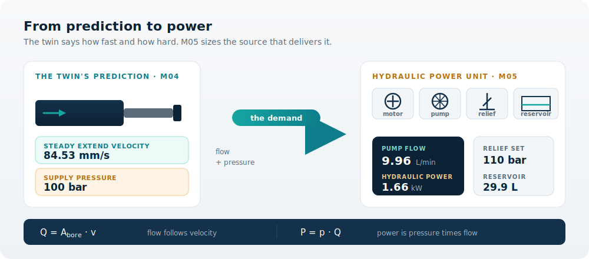
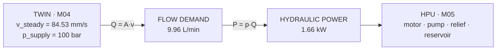

You are here

**Module 05 — Hydraulic Pumps and Power Generation** · **Unit 1 — Sizing the Power Source** · **Lesson 01 — Why the Machine Needs Power**

# Lesson 01 — Why the machine needs power

> **Module 05 · Lesson 01** · *The machine gains a power source.*
> By the end of Module 04 the machine could *predict* its own motion. This lesson is where it starts to *demand* the flow and pressure that make the prediction real — and where you learn to read that demand straight from the twin.
>
> **Learning outcome (LO1):** Explain why the workcell needs a dedicated power source, and read the flow and pressure demand the cylinder imposes from the twin's prediction.

---

## 1. Why This Matters

By the end of Module 04 your machine could *predict its own motion*. The digital twin told you the cylinder would extend at a steady **84.53 mm/s** and that the cap-side pressure would settle near its working value. That prediction is real — but nothing in the machine yet *makes* it happen. A simulation that says "the tool will move at 84.53 mm/s" is a promise the machine cannot keep until something pushes fluid into the cylinder, at pressure, at the right rate.

That something is the **Hydraulic Power Unit (HPU)** — the motor, pump, relief valve, and reservoir you design across this module. Lesson 01 is where the machine stops being a description and starts demanding a power source. Before you can *choose* a pump (Lesson 02) or *size* a motor (Lesson 03), you must answer one question precisely: **how much flow, at how much pressure, does this machine actually need?** The twin already contains the answer. This lesson teaches you to read it.

## 2. Physical Intuition

Hold two quantities apart in your head, because they are different things:

- **Pressure** is *how hard* the fluid pushes. It is set by the load the cylinder must overcome. Lift a heavier object and the pressure rises. Pressure is a "how strong" quantity.
- **Flow** is *how fast* fluid is delivered. It sets how quickly the cylinder extends. Want the tool to move faster, and you must deliver more flow. Flow is a "how fast" quantity.

A power source must supply **both at once**. A pump that delivers enormous flow at trivial pressure is a fan; a pump that delivers crushing pressure at no flow is a dead-ended brick. The machine needs the *combination*: enough pressure to move the load, delivered fast enough to hit the target velocity. The product of the two — pressure × flow — is **hydraulic power**, and that is what the prime mover must actually pay for.

## 3. Mathematical Foundations

Two relationships carry this entire lesson.

**Flow demand from velocity.** A cylinder is a moving piston of bore area $A_\text{bore}$. To extend the rod at velocity $v$, you must fill the volume it vacates at exactly that rate:

$$ Q = A_\text{bore}\, v, \qquad A_\text{bore} = \frac{\pi}{4} d_\text{bore}^2 $$

Flow is volume per unit time ($\text{m}^3/\text{s}$) — just geometry: bore area times speed.

**Hydraulic power from pressure and flow.** The power carried by the fluid is the pressure it works against times the rate it is delivered:

$$ P_\text{hyd} = p_\text{supply}\, Q $$

With $p$ in pascals and $Q$ in $\text{m}^3/\text{s}$, $P_\text{hyd}$ is in watts. That is the power the HPU must put *into* the fluid; because no pump or motor is perfect, the prime mover supplies somewhat more (Lesson 03).

## 4. Visual Explanation



The twin sits on the left as a prediction — a velocity and a pressure. M05 sits on the right as the means — a sized motor, pump, relief, and reservoir. The single hand-off between them carries two numbers, and reading them correctly is the whole job of this lesson.



The chain is one-directional and tight: a velocity becomes a flow, a flow at pressure becomes power, and that power is what the HPU is sized to deliver.

## 5. Engineering Example

Take the Smart Agricultural Workcell cylinder from the canonical parameters (`wp-1.1.0`): a **50 mm bore**, operating against a **100 bar** supply. In Module 04 the twin predicted a steady extend velocity of **84.53 mm/s** for the positioning task.

An engineer who skips this lesson reaches for a pump catalogue and picks something that "looks about right." An engineer who does this lesson first computes the demand, then selects against it — and finds the machine needs a surprisingly modest pump (about 10 L/min) but at high pressure. That combination — low flow, high pressure — is exactly what tells you *which kind* of pump to choose in Lesson 02. The demand drives the selection, not the other way around.

## 6. Worked Example

**Given** (from the twin and canonical `wp-1.1.0`): $d_\text{bore} = 0.050\ \text{m}$, $v = 0.08453\ \text{m/s}$, $p_\text{supply} = 10{,}000{,}000\ \text{Pa}$ (100 bar).

**Step 1 — bore area.**

$$ A_\text{bore} = \frac{\pi}{4}(0.050)^2 = 1.9635\times10^{-3}\ \text{m}^2 $$

**Step 2 — flow demand.**

$$ Q = A_\text{bore}\, v = 1.9635\times10^{-3}\times 0.08453 = 1.6598\times10^{-4}\ \text{m}^3/\text{s} $$

Converting: $1.6598\times10^{-4}\ \text{m}^3/\text{s} \times 1000 \times 60 = \mathbf{9.96\ L/min}$.

**Step 3 — hydraulic power.**

$$ P_\text{hyd} = p_\text{supply}\, Q = 10^{7}\times 1.6598\times10^{-4} = 1659.8\ \text{W} \approx \mathbf{1.66\ kW} $$

So the machine demands roughly **10 L/min at 100 bar**, costing **1.66 kW** of fluid power. These are the exact figures the `power_unit` artifact carries; this lesson establishes where the first two come from. (Prime-mover power, ≈ 1.95 kW once efficiency is included, is Lesson 03.)

## 7. Interactive Demonstration

[Open the demo in a new tab ↗](demos/lesson01_flow_and_power_demand.html)

Drag the **extend velocity** and **bore** and watch the flow the pump must deliver — and the hydraulic power it costs — update live through $Q = A v$ and $P = pQ$. Confirm the canonical workcell figures (9.96 L/min at 100 bar = 1.66 kW), then predict before you drag: if you double the velocity, what happens to flow, and to power? The demo is the worked example made movable.

## 8. Coding Exercise

*A first taste; the full tested module ships as this lesson's `code/` artifact.*

```python
import math

def flow_and_power_demand(bore_d_m, v_steady_ms, p_supply_pa):
    """Return (Q_m3s, Q_Lmin, P_hyd_W) the cylinder imposes on the power source."""
    A_bore = math.pi / 4 * bore_d_m**2      # m^2
    Q = A_bore * v_steady_ms                 # m^3/s
    Q_Lmin = Q * 1000 * 60                   # L/min
    P_hyd = p_supply_pa * Q                  # W
    return Q, Q_Lmin, P_hyd

# canonical wp-1.1.0 + twin prediction
Q, Q_Lmin, P_hyd = flow_and_power_demand(0.050, 0.08453, 10_000_000)
print(f"{Q_Lmin:.2f} L/min, {P_hyd/1000:.2f} kW")   # expect: 9.96 L/min, 1.66 kW
```

**Your task:** confirm the printed values match the worked example, then find the extend velocity at which the demand *doubles*. Because flow is linear in velocity, the answer should be exactly twice 84.53 mm/s — verify it.

## 9. Knowledge Check

[Open the knowledge check in a new tab ↗](quizzes/lesson01_quiz.html)

*Formative — unlimited attempts, immediate feedback. Not graded. Check your understanding, not your score.*

1. The machine must move **faster**. Which demand quantity rises — flow, pressure, or both?
2. The machine must lift a **heavier** load at the same speed. Which rises?
3. A pump delivers high flow but almost no pressure. Why can't it power the workcell?
4. Where in the build sequence does the velocity number in this lesson come from?
5. True or false: switching the Trainer to SI changes the hydraulic power the machine needs.

## 10. Challenge Problem

The positioning benchmark (Task 1) requires the tool to **settle within a defined cycle time**. A stakeholder asks you to halve the cycle time without changing the stroke. Arguing from the two equations alone — no new physics — describe what happens to the required flow, and therefore to the hydraulic power and the pump you must select. State which downstream lesson (02, 03, or 04) your conclusion most affects, and why.

## 11. Common Mistakes

- **Confusing flow with pressure.** "More powerful pump" is ambiguous. Always ask: more flow (faster) or more pressure (stronger)? They come from different demands and lead to different pump choices.
- **Sizing from a guess instead of the twin.** The velocity is not a number you invent; it is the twin's prediction. Sizing against a made-up speed produces a machine that is either starved or wastefully oversized.
- **Forgetting that power is the *product*.** A small flow at high pressure and a large flow at low pressure can demand the same kilowatts. Never reason about one number alone.
- **Reading units as physics.** 9.96 L/min and 2.63 gpm are the same demand. A unit toggle never changes what the machine needs.

## 12. Key Takeaways

- A prediction is not a power source. M05 exists to *supply* the motion M04 predicted.
- The machine's demand is two numbers: a **flow** (set by velocity and bore) and a **pressure** (set by the load). Their product is **hydraulic power**.
- $Q = A_\text{bore}\,v$ and $P_\text{hyd} = p_\text{supply}\,Q$ carry the whole lesson.
- For the canonical workcell at `wp-1.1.0`: ≈ **9.96 L/min at 100 bar = 1.66 kW** of fluid-power demand.
- These numbers are *read from the twin*, not invented — which is what makes the curriculum a build rather than a guess. Lesson 02 uses this demand to choose the pump.

## AI Learning Companion

Copy any prompt below into ChatGPT, Claude, or another AI assistant.

**Tutor prompt** — explain it another way

```
Re-explain Module 05 Lesson 01 (Why the machine needs power) without using the greenhouse workcell. Use a different hydraulic machine (e.g. an excavator arm). Focus on why flow comes from velocity and pressure comes from load, and why their product is the power the source must deliver.
```

**Practice prompt** — generate more exercises

```
Give me 5 short exercises that test whether I can decide, for a given change to a hydraulic machine, whether the FLOW demand, the PRESSURE demand, or both must rise — and why. Include answers.
```

**Explore prompt** — connect it to the real world

```
Show me 3 real fluid-powered machines and, for each, identify what sets its flow demand and what sets its pressure demand, and roughly how much hydraulic power that implies.
```

## Global Learning Support

Need this lesson in another language? Copy a prompt into an AI assistant. English remains the authoritative source.

**Supported languages (initial):** English · Español · 中文 (Simplified) · Türkçe

```
I just completed Module 05 Lesson 01 — Why the machine needs power.
Explain this lesson in [Spanish / Simplified Chinese / Turkish]. Keep hydraulics and mathematical terminology in English where commonly used.
Then provide: a summary, three practice questions, and one challenge problem.
```

---

*Next lesson: 02 — Choosing the power source (using this demand to select the pump and prime mover).*
